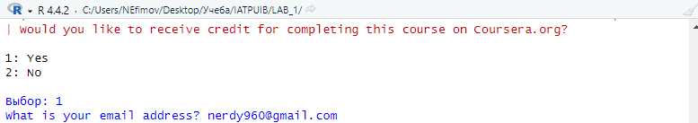

# LAB_1
Ефимов Никита

Информационно-аналитические технологии поиска угроз инорфмационной
безопасности

# Введение в R

## Цель работы

Развить навыки работы с языком программирования R и закрепить знания
базовых типов данных и операций с ними

## Исходные данные

1.  Операционная система Windows 10
2.  Rstudio Desktop
3.  Интерпретатор языка R версии 4.4.2
4.  Github
5.  Программный пакет swirl

## План выполнения работы

1.  Установить программный пакет swirl
2.  Выполнить курсы, указанные в задание

## Содержание Работы

### Шаг 1. Установка программного пакет swirl.

На данном шаге необходимо установить программный пакет swirl.


### Шаг 2. Запуск swirl и выбор обучения


### Шаг 3. Выполнение курсов

``` r
5 + 7
```

    [1] 12

``` r
x <- 5 + 7
```

``` r
x
```

    [1] 12

``` r
y <- x - 3
```

``` r
y
```

    [1] 9

``` r
z <- c(1.1, 9, 3.14)
```

``` r
?c
```

    запускаю httpd сервер помощи... готово

``` r
z
```

    [1] 1.10 9.00 3.14

``` r
z2 <- c(z,555)
```

``` r
c (z,555,z)
```

    [1]   1.10   9.00   3.14 555.00   1.10   9.00   3.14

``` r
z * 2 + 100
```

    [1] 102.20 118.00 106.28

``` r
my_sqrt <- sqrt(z - 1)
```

``` r
my_sqrt
```

    [1] 0.3162278 2.8284271 1.4628739

``` r
 my_div <- z / my_sqrt
```

``` r
my_div
```

    [1] 3.478505 3.181981 2.146460

``` r
c(1, 2, 3, 4) + c(0, 10)
```

    [1]  1 12  3 14

``` r
c(1, 2, 3, 4) + c(0, 10, 100)
```

    Warning in c(1, 2, 3, 4) + c(0, 10, 100): длина большего объекта не является
    произведением длины меньшего объекта

    [1]   1  12 103   4

``` r
z * 2 + 100
```

    [1] 102.20 118.00 106.28

``` r
z * 2 + 1000
```

    [1] 1002.20 1018.00 1006.28

``` r
my_div
```

    [1] 3.478505 3.181981 2.146460

``` r
getwd()
```

    [1] "C:/Users/NEfimov/Desktop/Учеба/IATPUIB/LAB_1"

``` r
ls()
```

    [1] "my_div"  "my_sqrt" "x"       "y"       "z"       "z2"     

``` r
x <- 9
```

``` r
ls()
```

    [1] "my_div"  "my_sqrt" "x"       "y"       "z"       "z2"     

``` r
dir()
```

    [1] "Images"           "mytest2.R"        "mytest3.R"        "README.md"       
    [5] "README.qmd"       "README.rmarkdown" "testdir"         

``` r
?list.files
```

``` r
args(list.files())
```

    NULL

``` r
args(list.files)
```

    function (path = ".", pattern = NULL, all.files = FALSE, full.names = FALSE, 
        recursive = FALSE, ignore.case = FALSE, include.dirs = FALSE, 
        no.. = FALSE) 
    NULL

``` r
old.dir <- getwd()
```

``` r
dir.create("testdir")
```

    Warning in dir.create("testdir"): 'testdir' уже существует

``` r
setwd("testdir")
```

``` r
file.create("mytest.R")
```

    [1] TRUE

``` r
ls()
```

    [1] "my_div"  "my_sqrt" "old.dir" "x"       "y"       "z"       "z2"     

``` r
list.files()
```

    [1] "Images"           "mytest.R"         "mytest2.R"        "mytest3.R"       
    [5] "README.md"        "README.qmd"       "README.rmarkdown" "testdir"         

``` r
file.exists("mytest.R")
```

    [1] TRUE

``` r
file.info("mytest.R")
```

             size isdir mode               mtime               ctime
    mytest.R    0 FALSE  666 2024-11-24 19:36:57 2024-11-24 19:36:57
                           atime exe
    mytest.R 2024-11-24 19:36:57  no

``` r
file.rename("mytest.R", "mytest2.R")
```

    [1] TRUE

``` r
file.copy("mytest2.R", "mytest3.R")
```

    [1] FALSE

``` r
file.path("mytest3.R")
```

    [1] "mytest3.R"

``` r
file.path("folder1", "folder2")
```

    [1] "folder1/folder2"

``` r
?dir.create
```

``` r
dir.create(file.path('testdir2', 'testdir3'), recursive = TRUE)
```

``` r
unlink('testdir2', recursive = TRUE)
```

``` r
setwd(old.dir)
```

``` r
1:20
```

     [1]  1  2  3  4  5  6  7  8  9 10 11 12 13 14 15 16 17 18 19 20

``` r
pi:10
```

    [1] 3.141593 4.141593 5.141593 6.141593 7.141593 8.141593 9.141593

``` r
15:1
```

     [1] 15 14 13 12 11 10  9  8  7  6  5  4  3  2  1

``` r
?':'
```

``` r
seq(1,20)
```

     [1]  1  2  3  4  5  6  7  8  9 10 11 12 13 14 15 16 17 18 19 20

``` r
seq(0, 10, by=0.5)
```

     [1]  0.0  0.5  1.0  1.5  2.0  2.5  3.0  3.5  4.0  4.5  5.0  5.5  6.0  6.5  7.0
    [16]  7.5  8.0  8.5  9.0  9.5 10.0

``` r
my_seq <- seq(5, 10, length=30)
```

``` r
length(my_seq)
```

    [1] 30

``` r
1:length(my_seq)
```

     [1]  1  2  3  4  5  6  7  8  9 10 11 12 13 14 15 16 17 18 19 20 21 22 23 24 25
    [26] 26 27 28 29 30

``` r
seq(along.with = my_seq)
```

     [1]  1  2  3  4  5  6  7  8  9 10 11 12 13 14 15 16 17 18 19 20 21 22 23 24 25
    [26] 26 27 28 29 30

``` r
seq_along(my_seq)
```

     [1]  1  2  3  4  5  6  7  8  9 10 11 12 13 14 15 16 17 18 19 20 21 22 23 24 25
    [26] 26 27 28 29 30

``` r
rep(0, times=40)
```

     [1] 0 0 0 0 0 0 0 0 0 0 0 0 0 0 0 0 0 0 0 0 0 0 0 0 0 0 0 0 0 0 0 0 0 0 0 0 0 0
    [39] 0 0

``` r
rep(c(0, 1, 2), times = 10)
```

     [1] 0 1 2 0 1 2 0 1 2 0 1 2 0 1 2 0 1 2 0 1 2 0 1 2 0 1 2 0 1 2

``` r
rep(c(0, 1, 2), each = 10)
```

     [1] 0 0 0 0 0 0 0 0 0 0 1 1 1 1 1 1 1 1 1 1 2 2 2 2 2 2 2 2 2 2

``` r
num_vect <- c(0.5, 55, -10, 6)
```

``` r
tf <- (num_vect < 1)
```

``` r
tf <- num_vect < 1
```

``` r
tf
```

    [1]  TRUE FALSE  TRUE FALSE

``` r
num_vect >= 6
```

    [1] FALSE  TRUE FALSE  TRUE

``` r
my_char <- c("My", "name", "is")
```

``` r
my_char
```

    [1] "My"   "name" "is"  

``` r
paste(my_char, collapse = " ")
```

    [1] "My name is"

``` r
my_name <- c(my_char, "Johnny")
```

``` r
my_name
```

    [1] "My"     "name"   "is"     "Johnny"

``` r
paste(my_name, collapse = " ")
```

    [1] "My name is Johnny"

``` r
paste("Hello", "world!", sep = " ")
```

    [1] "Hello world!"

``` r
paste(1:3, c("X", "Y", "Z"), sep = "")
```

    [1] "1X" "2Y" "3Z"

``` r
paste(LETTERS, 1:4, sep = "-")
```

     [1] "A-1" "B-2" "C-3" "D-4" "E-1" "F-2" "G-3" "H-4" "I-1" "J-2" "K-3" "L-4"
    [13] "M-1" "N-2" "O-3" "P-4" "Q-1" "R-2" "S-3" "T-4" "U-1" "V-2" "W-3" "X-4"
    [25] "Y-1" "Z-2"

``` r
x <- c(44, NA, 5, NA)
```

``` r
x * 3
```

    [1] 132  NA  15  NA

``` r
y <- rnorm(1000)
```

``` r
 z <- rep(NA, 1000)
```

``` r
my_data <- sample(c(y, z), 100)
```

``` r
my_na <- is.na(my_data)
```

``` r
my_na
```

      [1] FALSE  TRUE  TRUE  TRUE  TRUE FALSE  TRUE FALSE  TRUE  TRUE  TRUE FALSE
     [13] FALSE FALSE  TRUE FALSE  TRUE  TRUE FALSE FALSE FALSE FALSE  TRUE  TRUE
     [25]  TRUE FALSE  TRUE  TRUE FALSE  TRUE  TRUE FALSE  TRUE  TRUE  TRUE  TRUE
     [37] FALSE FALSE FALSE FALSE FALSE  TRUE  TRUE FALSE FALSE FALSE FALSE FALSE
     [49]  TRUE FALSE  TRUE  TRUE FALSE FALSE  TRUE FALSE  TRUE FALSE  TRUE FALSE
     [61] FALSE  TRUE FALSE FALSE  TRUE  TRUE FALSE FALSE FALSE FALSE FALSE  TRUE
     [73]  TRUE FALSE FALSE FALSE  TRUE  TRUE FALSE  TRUE FALSE FALSE FALSE  TRUE
     [85] FALSE FALSE  TRUE FALSE  TRUE  TRUE  TRUE FALSE  TRUE FALSE  TRUE  TRUE
     [97]  TRUE FALSE  TRUE  TRUE

``` r
my_data == NA
```

      [1] NA NA NA NA NA NA NA NA NA NA NA NA NA NA NA NA NA NA NA NA NA NA NA NA NA
     [26] NA NA NA NA NA NA NA NA NA NA NA NA NA NA NA NA NA NA NA NA NA NA NA NA NA
     [51] NA NA NA NA NA NA NA NA NA NA NA NA NA NA NA NA NA NA NA NA NA NA NA NA NA
     [76] NA NA NA NA NA NA NA NA NA NA NA NA NA NA NA NA NA NA NA NA NA NA NA NA NA

``` r
sum(my_na)
```

    [1] 49

``` r
my_data
```

      [1]  1.07573031          NA          NA          NA          NA  0.08791494
      [7]          NA -0.94696709          NA          NA          NA -1.46934012
     [13] -0.02359400  0.24836853          NA -2.09084474          NA          NA
     [19]  0.14294883 -0.86350921  0.56938140  1.13849482          NA          NA
     [25]          NA -0.55699571          NA          NA -1.85243484          NA
     [31]          NA -0.47548405          NA          NA          NA          NA
     [37]  0.98369151  0.55419445  0.84576336 -0.48029755  0.78083781          NA
     [43]          NA -0.57096211  2.27739927  0.40472143  1.22625640  2.27075574
     [49]          NA  0.48704193          NA          NA -1.15609261 -0.01364035
     [55]          NA -0.38676675          NA -0.75888437          NA  0.18046983
     [61] -1.16013599          NA  0.35012037  0.05621970          NA          NA
     [67]  0.76303994  1.49631432 -0.31832391  0.51583153  0.13297841          NA
     [73]          NA -0.06613242  0.09250195  0.62196214          NA          NA
     [79] -1.02802308          NA -1.85892426 -0.68690451 -1.62100361          NA
     [85]  0.34690575 -2.23832336          NA -0.25054113          NA          NA
     [91]          NA  1.66401507          NA  0.86002676          NA          NA
     [97]          NA -0.24441896          NA          NA

``` r
0 / 0
```

    [1] NaN

``` r
Inf - Inf
```

    [1] NaN

По окончании каждого из курсов также будет предложено получить
подтверждение прохождения (однако, для этого необходим специальный
токен)



## Оценка результата

В результате работы была установлена библиотека swirl, а также были
пройдены 5 подкурсов в рамках обучения “R Programming: The basics of
programming in R”

## Вывод

Были изучены базовые команды и функции языка R - работа с переменными,
векторами, файлами, циклами и NA.
