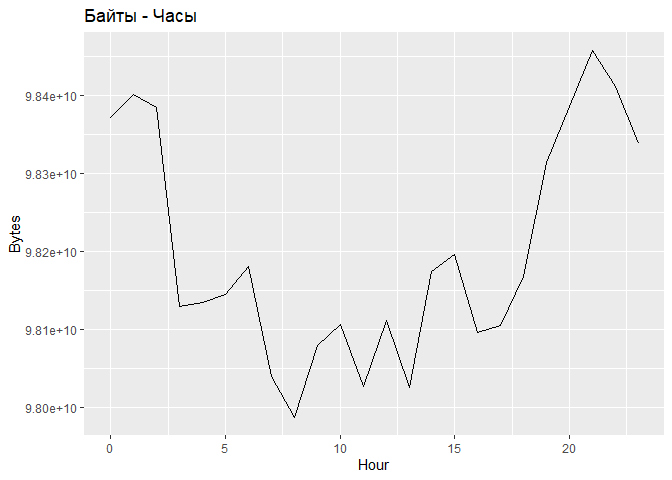
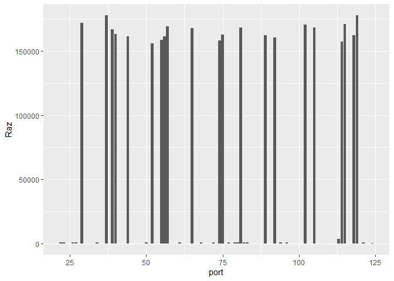

# LAB_7
Ефимов Никита

Информационно-аналитические технологии поиска угроз инорфмационной
безопасности

# Анализ данных сетевого трафика при помощи библиотеки Arrow

## Цель работы

1.  Изучить возможности технологии Apache Arrow для обработки и анализ
    больших данных
2.  Получить навыки применения Arrow совместно с языком программирования
    R
3.  Получить навыки анализа метаинфомации о сетевом трафике
4.  Получить навыки применения облачных технологий хранения, подготовки
    и анализа данных: Yandex Object Storage, Rstudio Server.

## Исходные данные

1.  Операционная система Windows 10
2.  Rstudio Desktop
3.  Интерпретатор языка R версии 4.4.2
4.  Github
5.  Yandex Object Storage
6.  Библиотека Apache Arrow

## План выполнения работы

1.  Импортировать данные
2.  Выполнить аналитические задания

## Содержание Работы

### Шаг 1. Импортировать данные

``` r
library(arrow)
```


    Присоединяю пакет: 'arrow'

    Следующий объект скрыт от 'package:utils':

        timestamp

``` r
library(dplyr)
```


    Присоединяю пакет: 'dplyr'

    Следующие объекты скрыты от 'package:stats':

        filter, lag

    Следующие объекты скрыты от 'package:base':

        intersect, setdiff, setequal, union

``` r
library(knitr)
library(stringr)
library(lubridate)
```


    Присоединяю пакет: 'lubridate'

    Следующий объект скрыт от 'package:arrow':

        duration

    Следующие объекты скрыты от 'package:base':

        date, intersect, setdiff, union

``` r
library(ggplot2)
library(lubridate)
library(tidyverse)
```

    ── Attaching core tidyverse packages ──────────────────────── tidyverse 2.0.0 ──
    ✔ forcats 1.0.0     ✔ tibble  3.2.1
    ✔ purrr   1.0.2     ✔ tidyr   1.3.1
    ✔ readr   2.1.5     

    ── Conflicts ────────────────────────────────────────── tidyverse_conflicts() ──
    ✖ lubridate::duration() masks arrow::duration()
    ✖ dplyr::filter()       masks stats::filter()
    ✖ dplyr::lag()          masks stats::lag()
    ℹ Use the conflicted package (<http://conflicted.r-lib.org/>) to force all conflicts to become errors

``` r
#download.file("https://storage.yandexcloud.net/arrow-datasets/tm_data.pqt",destfile = "tm_data.pqt")

#df <- read_parquet("tm_data.pqt", as_data_frame = FALSE)
df <- read_parquet("tm_data.pqt", use_threads=False, engine='fastparquet')
#df <- arrow::open_dataset(sources = "./tm_data.pqt", format = "parquet")
glimpse(df)
```

    Rows: 105,747,730
    Columns: 5
    $ timestamp <dbl> 1.578326e+12, 1.578326e+12, 1.578326e+12, 1.578326e+12, 1.57…
    $ src       <chr> "13.43.52.51", "16.79.101.100", "18.43.118.103", "15.71.108.…
    $ dst       <chr> "18.70.112.62", "12.48.65.39", "14.51.30.86", "14.50.119.33"…
    $ port      <int> 40, 92, 27, 57, 115, 92, 65, 123, 79, 72, 123, 123, 22, 118,…
    $ bytes     <int> 57354, 11895, 898, 7496, 20979, 8620, 46033, 1500, 979, 1036…

### Шаг 2. Выполнить аналитические задания

#### 1. Надите утечку данных из Вашей сети

``` r
df %>% filter(grepl("^(12|13|14)\\.", src)) %>% 
  group_by(src) %>% 
  summarise("sum" = sum(bytes)) %>% 
  arrange(desc(sum)) %>% 
  head(1) %>% select(src)
```

    # A tibble: 1 × 1
      src         
      <chr>       
    1 13.37.84.125

#### 2. Надите утечку данных 2

``` r
work_h <- df %>% mutate(trafic = (str_detect(src, "^((12|13|14)\\.)") & !str_detect(dst, "^((12|13|14)\\.)"))) %>% 
  mutate(time = as.POSIXct(df$timestamp)) %>% 
  mutate(hour = hour(time)) %>% 
  group_by(hour) %>% 
  summarise(total_bytes = sum(bytes, na.rm = TRUE)) %>% 
  arrange(hour)
```

``` r
ggplot(work_h, aes(x = hour, y = total_bytes)) + geom_line() + labs(title = "Байты - Часы", x = "Hour", y = "Bytes")
```



``` r
result <- df %>% mutate(time = as.POSIXct(df$timestamp)) %>%  mutate(hour = hour(time))  %>% 
  filter(src != '13.37.84.125') %>% 
  filter(str_detect(src, "^((12|13|14)\\.)")) %>% filter(!str_detect(dst, "^((12|13|14)\\.)")) %>%  
  filter(hour >= 0 & hour <= 15) %>%
  group_by(src) %>%
  summarise(total_bytes = sum(bytes)) %>%
  arrange(desc(total_bytes))
head(result, 1)
```

    # A tibble: 1 × 2
      src         total_bytes
      <chr>             <int>
    1 13.48.72.30  1150138691

#### 3. Надите утечку данных 3

``` r
task3 <- df %>% filter(src != '13.37.84.125' & src != '12.55.77.96') %>% group_by(port) %>% 
  summarise(mean_bytes = mean(bytes),max_bytes = max(bytes),sum_bytes = sum(bytes),Raz = max_bytes - mean_bytes) %>% 
  filter(Raz != 0) %>% arrange(desc(Raz))
```

``` r
ggplot(data = task3, aes(x = port, y = Raz)) + geom_col()
```



Рассмотрим порт № 37

``` r
result_3 <- df %>% filter(port == 37) %>%
  group_by(src) %>% summarise(traffic = sum(bytes), count = n(), avg = traffic/count, med = median(bytes)) %>% arrange(desc(avg))
```

``` r
print(head(result_3, 1))
```

    # A tibble: 1 × 5
      src           traffic count   avg   med
      <chr>           <int> <int> <dbl> <dbl>
    1 18.100.115.80   87607     1 87607 87607

## Оценка результата

В результате практической работы были выполнены аналитические задания с
использованием библиотеки arrow

## Вывод

В результате выполнения практической работы были освоены инструменты
работы с Apache Arrow
